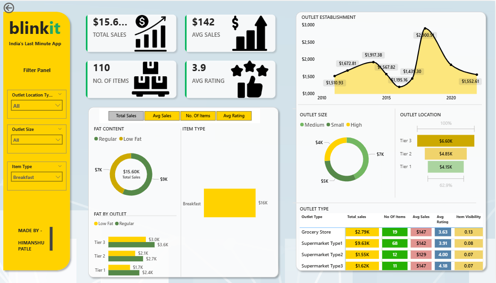

# 📦 Blinkit Data Analyst Project

This project is a detailed data analysis of Blinkit – India's last-minute delivery app. The analysis focuses on understanding item sales, outlet performance, and customer ratings using **Python in Jupyter Notebook** for data wrangling and **Power BI** for dashboard visualization.

---

## 🧰 Tools & Technologies Used

- **Python** – Data Cleaning and Exploration
- **Jupyter Notebook** – Data Analysis
- **Power BI** – Interactive Dashboard Visualization
- **Libraries:** pandas, matplotlib

---

## 📌 Objective

To extract actionable business insights from Blinkit's sales dataset by:

- Analyzing sales trends and patterns across different outlet types and locations
- Understanding the impact of item characteristics like fat content, type, and visibility
- Identifying high-performing categories and locations to support data-driven decisions

---

## 📊 Power BI Dashboard Overview

The Power BI report provides a quick and interactive overview of key business metrics:

💰 Total Sales 
🛍️ Number of Items 
📉 Avg Sales per Item 
⭐ Avg Rating

### 🔎 Key Features:
- Filter Panel: Outlet type, outlet size, item type
- Line Chart: Outlet establishment year vs sales
- Pie Charts: Sales by fat content and outlet size
- Bar Charts: Sales by location tier and item type
- Detailed KPI Table: Outlet-wise metrics (total sales, ratings, item count)

🖼️ **Sample Dashboard Screenshot:**   



---

## 📘 Jupyter Notebook Summary

Performed EDA and data preprocessing steps in Python:

### 🔍 Key Steps:
- Cleaned missing values and formatted data types
- Visualized distribution of fat content, outlet sales, item types, and ratings
- Identified trends between outlet attributes and sales performance

---

## 📈 Insights & Takeaways

### **Missing Value Strategy**
- Chose median imputation for `Item Weight` as it's robust to outliers
- Demonstrated multiple imputation techniques for educational purposes

### **Data Quality Issues Addressed**
- Standardized categorical data format
- Cleaned inconsistent values in fat content classification

### **Sales Analysis Findings**
- Sales distribution shows typical retail patterns
- Identified top-performing product categories
- Outlet type significantly impacts average sales performance

## 📊 Visualization Features
- **Style**: Consistent dark grid background with colorful palette
- **Chart Types**: Histograms, box plots, bar charts
- **Layout**: Clean, professional formatting with appropriate labels and titles
---

## 📁 Files in Repository
```
Blinkit-Sales-Analysis-Python-PowerBI/
├──Blinkit Analysis.ipynb          # Main Python analysis notebook
├── Blinkit_Analysis.pbix           # Power BI dashboard file
├── BlinkIT_Grocery_Data.csv        # Original dataset
├── README.md                       # Project documentation (this file)
├── requirements.txt                # Python dependencies
└── images/                         # Visualization exports
    └── powerbi_dashboard.png       # Dashboard screenshot
```

## 👤 Author

**Himanshu Patle**  

[](https://www.instagram.com/h_imanshu_01/?next=%2F)
[](https://www.linkedin.com/in/himanshu-patle-2b563730b/)
[](https://github.com/imanshu-01)

---

## 📜 License
This project is intended for **Educational Purposes Only**.
All data and analysis are intended for learning and demonstration.

© 2026 Himanshu Patle. All rights reserved.
